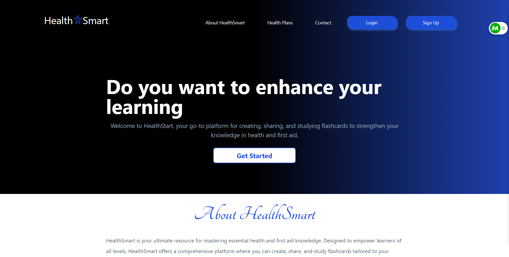

    

# HealthSmart Website (flashCard)

## Table of Contents

  
Table of Contents 

  <ol>
    <li><a href="#about-the-project">About The Project</a>
        <ul>
            <li><a href="#overview">Overview</a></li>
            <li><a href="#key-features">Key Features</a></li>
        </ul>
    </li>
    <li><a href="#built-with">Built With</a></li>
     <li><a href="#project-plan">Project Plan</a></li>
    <li><a href="#getting-started">Getting Started</a></li>
    <li><a href="#available-scripts">Available Scripts</a></li>
     </ol>

## About The Project
HealthSamrt is an innovative flashcard SaaS designed to supercharge your learning experience. Powered by Next.js, Clerk, Firebase, OpenAI, and Stripe. HealthSmart offers seamless user authentication, real-time data management, and AI-driven content generation.

Your ultimate pantry management solution. 
    
### Key Features
- **Powered by Next.js:** Enjoy a fast and responsive user interface for a smooth learning experience.
- **Seamless User Authentication:** Managed by Firebase Auth, ensuring secure and easy access to your account.
- **Real-time Data Management:** Handled by Firebase for efficient and reliable data handling.
- **AI-Driven Content Generation:** Powered by OpenAI, providing intelligent and adaptive flashcards tailored to your needs.

### Overview

* [Repo Codes](https://health-smart.vercel.app/)
* [Hosted Link](https://github.com/donkachii/health-smart)

(<a href="#top">back to top</a>)

### Built With
- [Next.js](https://nextjs.org/)
- [Tailwind CSS](https://tailwindcss.com/)
- [Firebase Console](https://firebase.google.com/)
- [Material UI](https://mui.com/)
- [OpenAI](https://openai.com/)

(<a href="#top">back to top</a>)

### Project Plan

  

(<a href="#top">back to top</a>)

### Getting Started

To get a local copy up and running, follow these simple steps:

### Available Scripts

In the project directory, you can run:

`npm run dev`

Runs the app in the development mode.

Open [http://localhost:3000](http://localhost:3000) to view it in your browser.

The page will reload when you make changes.

You may also see any lint errors in the console.

(<a href="#top">back to top</a>)

  

(<a href="#top">back to top</a>)

